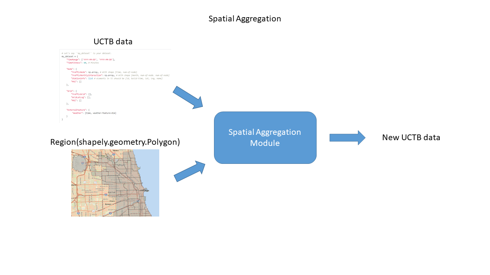
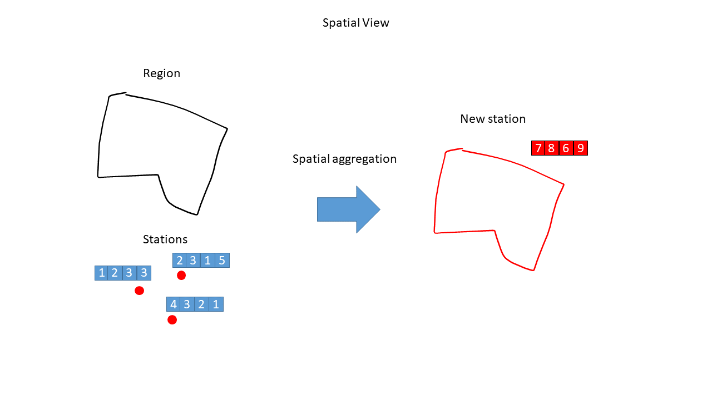

# RegionGeneration
A region generation framework for spatio-temporal prediction task
## Current Development Plan
We are now developing for spatial aggregation module.
Following two pictures are the discription of the input output and the function of the module.

The function is divided into two parts:
- bind stations' time series onto given regions
- aggregation

The UCTB data format, example UCTB data, and example regions are listed below.

- [UCTB data description](https://uctb.github.io/UCTB/md_file/urban_dataset.html)

- [`shapely.geometry.Polygon`](https://shapely.readthedocs.io/en/stable/reference/shapely.Polygon.html#shapely.Polygon)

- [UCTB data](https://github.com/uctb/Urban-Dataset/blob/main/Public_Datasets/Bike/60_minutes/Bike_Chicago.zip)

- [Region](https://data.cityofchicago.org/Facilities-Geographic-Boundaries/Boundaries-Community-Areas-current-/cauq-8yn6)

Please use information above to construct a test case to examine the module after finishing development.